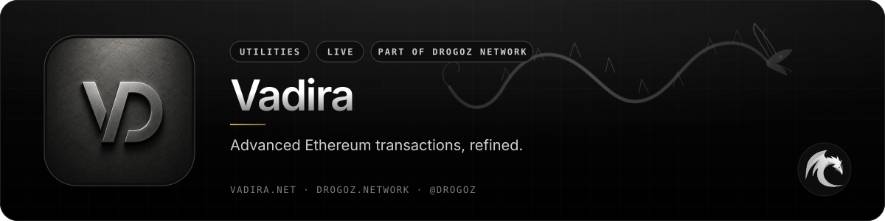
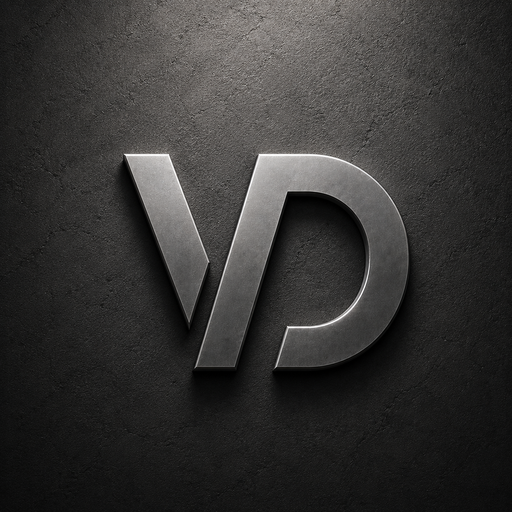
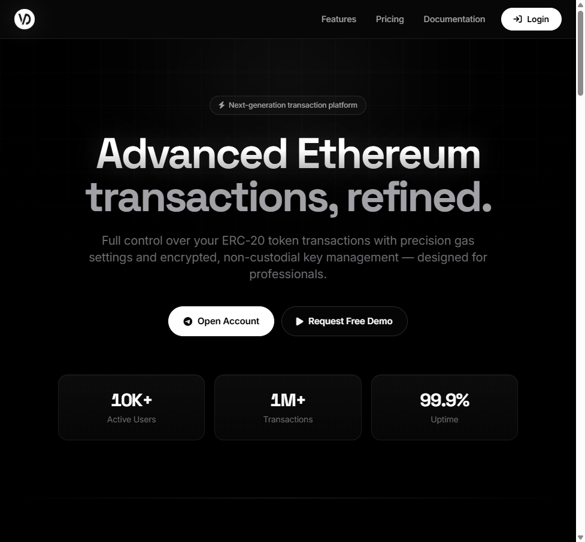
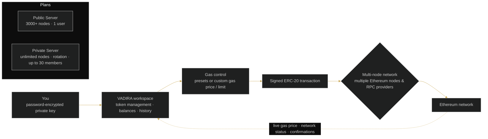

 

# Vadira

### Advanced Ethereum transactions, refined.

 

  

 

## 📋 Table of contents

- [Overview](#-overview)
- [Key features](#-key-features)
- [Screenshots](#-screenshots)
- [How it works](#%EF%B8%8F-how-it-works)
- [Use cases](#-use-cases)
- [Pricing](#-pricing)
- [Free live demonstration](#-free-live-demonstration)
- [Links](#-links)

## 🧭 Overview

VADIRA is an advanced, non-custodial Ethereum ERC-20 transaction platform designed for professionals. It gives you full control over your token transactions with precision gas settings — curated presets and custom values for gas price and gas limit — for optimal cost and confirmation.

Private keys are encrypted with a password only you know, using strong cryptography. Non-custodial by design: the platform connects through multiple Ethereum nodes and RPC providers for maximum reliability and speed, supports all ERC-20 tokens with custom token management and automatic balance tracking, and shows live gas price, network status and detailed transaction history.

Two subscription tiers are offered — a Public Server for individual professionals (unlimited transactions, 3000+ global nodes, one user account) and a Private Server for enterprise-level operations (advanced developer mode, unlimited global nodes, VIP merchant network, dynamic server rotation, up to 30 team members) — backed by dedicated account managers and 24/7 priority support.

<table>
<tr>
<td align="center" width="25%"><b>Category</b> Utilities</td>
<td align="center" width="25%"><b>Status</b> Live</td>
<td align="center" width="25%"><b>Bundle</b> Utilities (−2%)</td>
<td align="center" width="25%"><b>Pricing</b> Sign in to see pricing</td>
</tr>
</table>

## ✨ Key features

### ⛽ Transaction control

- **Custom Gas Settings** — full control over gas price and gas limit with curated presets and custom values for optimal cost and confirmation.
- **ERC-20 Support** — all ERC-20 tokens with custom token management and automatic balance tracking.
- **Unlimited transactions** on every plan.

### 🔐 Security

- **Secure Key Management** — private keys encrypted with a password only you know, using strong cryptography.
- **Non-custodial by design** — you hold the keys.
- **AES-grade encryption**.

### 🌐 Network

- **Multi-Node Network** — connect through multiple Ethereum nodes and RPC providers for maximum reliability and speed.
- **3000+ global nodes** (Public Server) · **unlimited global nodes** and **dynamic server rotation** (Private Server).
- **Real-time Monitoring** — live gas price and network status with transaction history and detailed insights.

### 🏢 Enterprise & support

- **Private Server** — advanced developer mode, VIP merchant network, dedicated VIP support, up to 30 team members.
- **24/7 Priority Support** — dedicated account managers and priority assistance whenever you need it.
- **Documentation Hub** — platform overview, step-by-step user guide, technical reference and FAQ.

## 🖼️ Screenshots

> Product images from [vadira.net](https://vadira.net/) and the [service page](https://drogoz.network/services/vadira/) on drogoz.network.

 VADIRA — Advanced Ethereum transactions, refined

## ⚙️ How it works

**Architecture — non-custodial, multi-node**

## 🎯 Use cases

<table>
<tr>
<td width="50%" valign="top"><b>👤 Individual professionals</b> Unlimited ERC-20 transactions with precise gas control on the Public Server.</td>
<td width="50%" valign="top"><b>🏢 Enterprise operations</b> Private Server with developer mode, VIP merchant network and up to 30 team members.</td>
</tr>
<tr>
<td width="50%" valign="top"><b>💹 Cost-sensitive transfers</b> Curated gas presets or custom values to balance cost against confirmation time.</td>
<td width="50%" valign="top"><b>🔑 Self-custody</b> Keys encrypted with a password only you know — the platform never holds them in the clear.</td>
</tr>
</table>

## 💳 Pricing

> **Sign in at [drogoz.network](https://drogoz.network/accounts/login/) to see pricing.** Your exact monthly cost, in seconds — no quotes, nothing hidden.

Vadira is part of the **Utilities** bundle (−2%) — *Core utility tools* — and of **All In One** (−10%) — *Every product, best price*. Take several products together and save more: [Packages & bundles](https://drogoz.network/#packages) · [Pricing & calculator](https://drogoz.network/pricing/).

| Bundle | Discount | Included |
|---|---|---|
| **Utilities** | −2% | Drog AI, MyMask AI, Replika, IMPERATORI, RiderSwap, Vadira, Skriper |
| **All In One** | −10% | Drog AI, MyMask AI, Replika, Lidaro AI, IMPERATORI, ZOI Talks, RiderSwap, HyperBlast AI, VerifHub AI, Vadira, Skriper |

## 🎥 Free live demonstration

**A live demonstration is 100% free on every product.** 
See Vadira in action before you pay — our agent gets in touch and walks you through a live demonstration.

Registration is handled by our team — get in touch and receive personal access.

## 🔗 Links

| Channel | Link |
|---|---|
| 🌐 **Website** | [vadira.net](https://vadira.net/) |
| 📄 **Details page** | [drogoz.network/services/vadira/](https://drogoz.network/services/vadira/) |
| ✈️ **Telegram group** | [@vadira_net](https://t.me/vadira_net) |
| 🏛️ **Drogoz Network** | [drogoz.network](https://drogoz.network) · [Services](https://drogoz.network/#services) · [Packages](https://drogoz.network/#packages) · [Pricing](https://drogoz.network/pricing/) · [Presentation](https://drogoz.network/presentation/) |
| ⚖️ **Legal** | [Terms of Service](https://drogoz.network/legal/terms-of-service/) · [Acceptable Use](https://drogoz.network/legal/acceptable-use-policy/) · [Privacy](https://drogoz.network/legal/privacy-policy/) · [Refunds](https://drogoz.network/legal/refund-policy/) · [Disclaimer](https://drogoz.network/legal/disclaimer/) · [Compliance](https://drogoz.network/legal/compliance-policy/) |
| 🐙 **GitHub** | [deepdrogo](https://github.com/deepdrogo/deepdrogo) |

 

   
  
    
  <b>Made by <a href="https://drogoz.network">Drogoz Network</a></b> 
  One network — all your services · Premium SaaS Network
    
  
  
  
  
    
  <b>More from the network:</b> <a href="https://github.com/deepdrogo/drog-ai">Drog AI</a> · <a href="https://github.com/deepdrogo/mymask-ai">MyMask AI</a> · <a href="https://github.com/deepdrogo/replika">Replika</a> · <a href="https://github.com/deepdrogo/lidaro-ai">Lidaro AI</a> · <a href="https://github.com/deepdrogo/imperatori">IMPERATORI</a> · <a href="https://github.com/deepdrogo/zoi-talks">ZOI Talks</a> · <a href="https://github.com/deepdrogo/riderswap-io">RiderSwap</a> · <a href="https://github.com/deepdrogo/hyperblast-ai">HyperBlast AI</a> · <a href="https://github.com/deepdrogo/verifhub-ai">VerifHub AI</a> · <a href="https://github.com/deepdrogo/skriper-io">Skriper</a> · <a href="https://github.com/deepdrogo/mytasker">MyTasker</a> · <a href="https://github.com/deepdrogo/mamont-tech">Mamont</a>
    
  © 2026 Drogoz Network. All rights reserved. Provided strictly for lawful use — see the <a href="https://drogoz.network/legal/">Legal Center</a>. Each user is solely responsible for how they use the software.

