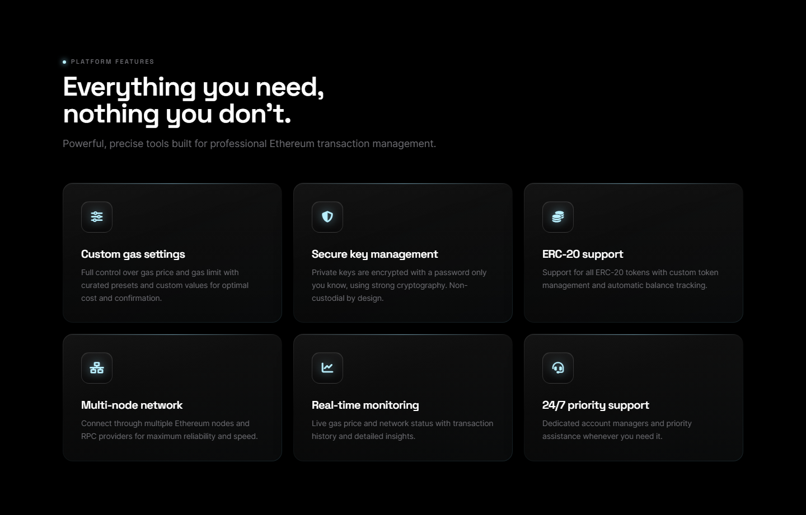
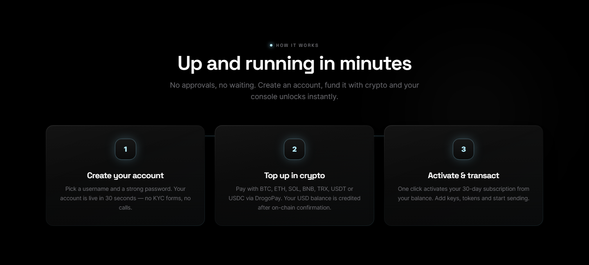
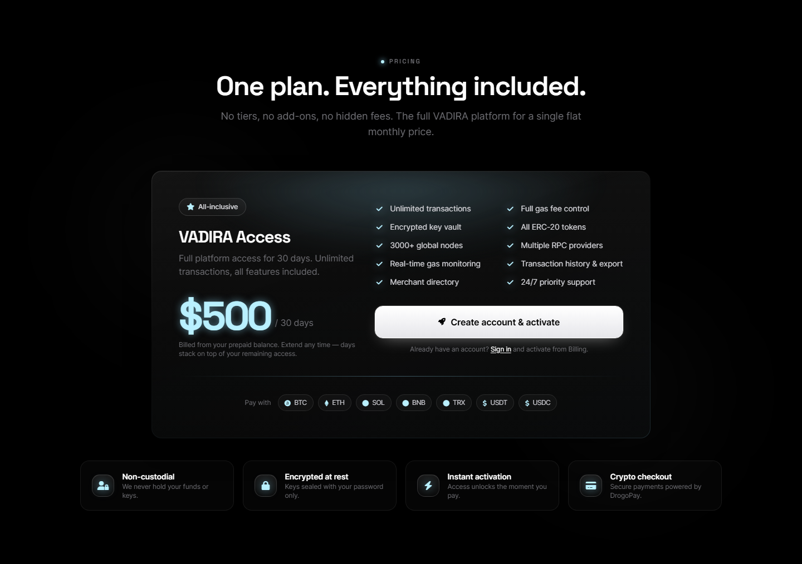
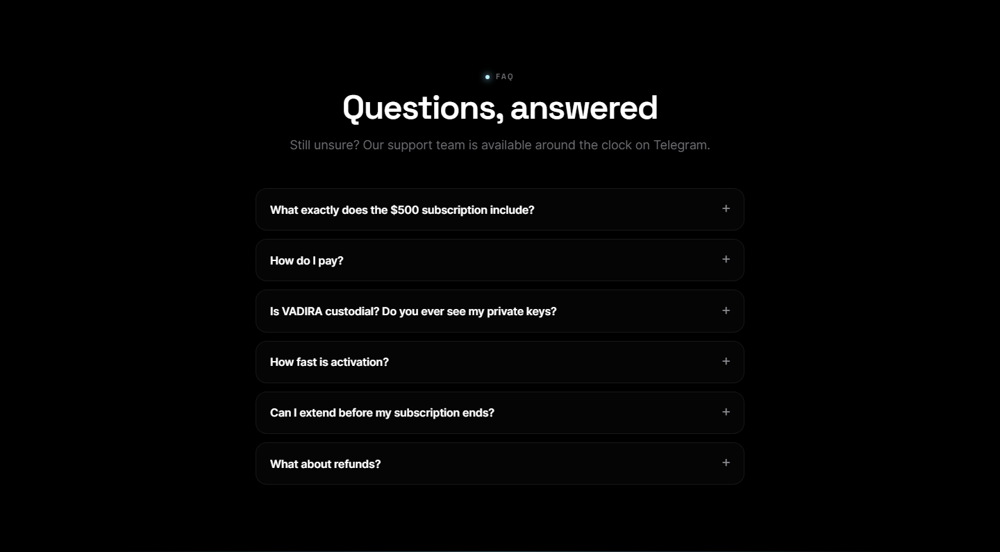
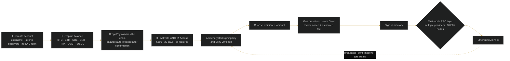

 

# Vadira

### Advanced Ethereum transactions, refined.

 

  

 

## 📋 Table of contents

- [Overview](#-overview)
- [Key features](#-key-features)
- [Screenshots](#-screenshots)
- [How it works](#%EF%B8%8F-how-it-works)
- [Use cases](#-use-cases)
- [Pricing](#-pricing)
- [Free live demonstration](#-free-live-demonstration)
- [Links](#-links)

## 🧭 Overview

**VADIRA is a professional, non-custodial Ethereum transaction workspace.** It combines ERC-20 token management, balances, transaction history and precision gas controls in one console, while the signing key remains encrypted under a password known only to the user.

Every transfer can use a curated gas preset — slow, recommended, fast or rapid — or a custom Gwei value and gas limit. VADIRA resolves recipients, estimates the fee, tracks the account nonce and broadcasts the signed transaction through several Ethereum nodes and RPC providers so one provider is not a single point of failure.

The current release has **one all-inclusive plan** rather than the previous public/private tier split: **$500 for 30 days**, unlimited transactions and all features included. Create an account without a KYC form, top up the prepaid USD balance in supported cryptocurrency through DrogoPay, and activate instantly after on-chain confirmation. Renewals stack on top of remaining days.

<table>
<tr>
<td align="center" width="25%"><b>Category</b> Utilities</td>
<td align="center" width="25%"><b>Status</b> Live</td>
<td align="center" width="25%"><b>Bundle</b> Utilities (−2%)</td>
<td align="center" width="25%"><b>Pricing</b> $500 / 30 days</td>
</tr>
</table>

## ✨ Key features

### ⛽ Precision transaction control

- **Gas presets and custom Gwei** — slow, recommended, fast, rapid or a value you choose.
- **Gas-limit control and fee estimate** — review the projected network cost before signing.
- **Recipient resolution** — work with Ethereum addresses and resolved names where available.
- **Nonce and confirmation visibility** — see signing context, broadcast result and recent confirmations in the same workspace.
- **Unlimited transactions** during the active 30-day access period.

### 🔐 Non-custodial key model

- **Password-encrypted key vault** — keys are sealed at rest under the user's password.
- **In-memory signing** — the documented flow decrypts a selected key only for local signing, then broadcasts the signed transaction.
- **VADIRA does not hold funds or keys** — assets stay under the user's Ethereum accounts.
- **Security context on every transaction** — selected key, nonce, current gas and estimated fee are visible before broadcast.

### 🌐 Network

- **Multiple Ethereum nodes and RPC providers** — failover and routing for reliability and speed.
- **3,000+ global nodes** included in the current plan.
- **Real-time gas and network status** — make the speed/cost decision with current conditions visible.
- **Transaction history and export** — retain an operational record and take it into downstream reporting.

### 🪙 Tokens, billing & activation

- **All ERC-20 tokens** — add custom contracts and track balances in one console.
- **Automatic balance credit** through DrogoPay after the selected chain confirms.
- **Supported top-ups** — BTC, ETH, SOL, BNB, TRX, USDT and USDC.
- **Instant one-click activation** from Billing once the prepaid balance covers the plan.
- **Early extension without lost days** — each renewal adds another 30 days to the remaining term.

### 🤝 Professional operations

- **Merchant directory** included with the platform.
- **Dedicated account manager and 24/7 priority support**.
- **No tiers or add-ons** — the entire feature set is included in VADIRA Access.

## 🖼️ Screenshots

> Product images from [vadira.net](https://vadira.net/) and the [service page](https://drogoz.network/services/vadira/) on drogoz.network.

<table>
<tr>
<td width="50%" align="center"> VADIRA — Advanced Ethereum transactions, refined</td>
<td width="50%" align="center"> The complete platform feature set — gas control, encrypted keys, ERC-20 support, multi-node routing and monitoring</td>
</tr>
<tr>
<td width="50%" align="center"> Create an account, top up in crypto, then activate and transact</td>
<td width="50%" align="center"> One all-inclusive plan — $500 for 30 days, unlimited transactions and every feature</td>
</tr>
<tr>
<td colspan="2" align="center"> Current answers for plan coverage, payment, custody, activation, extension and refunds</td>
</tr>
</table>

## ⚙️ How it works

**From account creation to an on-chain ERC-20 confirmation**

## 🎯 Use cases

<table>
<tr>
<td width="50%" valign="top"><b>👤 Professional operators</b> Manage keys, custom ERC-20 tokens, balances and unlimited transfers from one transaction console.</td>
<td width="50%" valign="top"><b>🏢 Treasury workflows</b> Select the right signing key, validate the recipient and fee, then retain the result in exportable history.</td>
</tr>
<tr>
<td width="50%" valign="top"><b>💹 Cost-sensitive transfers</b> Curated gas presets or custom values to balance cost against confirmation time.</td>
<td width="50%" valign="top"><b>⚡ Time-sensitive transfers</b> Choose fast or rapid gas and route through multiple providers when confirmation speed matters.</td>
</tr>
<tr>
<td width="50%" valign="top"><b>🔑 Self-custody</b> Keep funds under user-controlled Ethereum keys while using the platform for signing and broadcast workflow.</td>
<td width="50%" valign="top"><b>📊 Audit and reporting</b> Monitor transaction status and export history for reconciliation or operational review.</td>
</tr>
</table>

## 💳 Pricing

> **One plan: $500 for 30 days.** VADIRA Access includes unlimited transactions, every ERC-20 token, full gas control, the encrypted key vault, multi-provider RPC access, 3,000+ global nodes, live gas monitoring, transaction history/export, the merchant directory and priority support. Top up with BTC, ETH, SOL, BNB, TRX, USDT or USDC through DrogoPay; activate from the prepaid balance in one click. Extending early adds 30 days to the remaining access period.

Vadira is part of the **Utilities** bundle (−2%) — *Core utility tools* — and of **All In One** (−10%) — *Every product, best price*. Take several products together and save more: [Packages & bundles](https://drogoz.network/#packages) · [Pricing & calculator](https://drogoz.network/pricing/).

| Bundle | Discount | Included |
|---|---|---|
| **Utilities** | −2% | Drog AI, MyMask AI, Replika, IMPERATORI, RiderSwap, Vadira, Skriper |
| **All In One** | −10% | Drog AI, MyMask AI, Replika, Lidaro AI, IMPERATORI, ZOI Talks, RiderSwap, HyperBlast AI, VerifHub AI, Vadira, Skriper |

## 🎥 Free live demonstration

**A live demonstration is 100% free on every product.** 
See Vadira in action before you pay — our agent gets in touch and walks you through a live demonstration.

Registration is handled by our team — get in touch and receive personal access.

## 🔗 Links

| Channel | Link |
|---|---|
| 🌐 **Website** | [vadira.net](https://vadira.net/) |
| 📄 **Details page** | [drogoz.network/services/vadira/](https://drogoz.network/services/vadira/) |
| ✈️ **Telegram group** | [@vadira_net](https://t.me/vadira_net) |
| 🏛️ **Drogoz Network** | [drogoz.network](https://drogoz.network) · [Services](https://drogoz.network/#services) · [Packages](https://drogoz.network/#packages) · [Pricing](https://drogoz.network/pricing/) · [Presentation](https://drogoz.network/presentation/) |
| ⚖️ **Legal** | [Terms of Service](https://drogoz.network/legal/terms-of-service/) · [Acceptable Use](https://drogoz.network/legal/acceptable-use-policy/) · [Privacy](https://drogoz.network/legal/privacy-policy/) · [Refunds](https://drogoz.network/legal/refund-policy/) · [Disclaimer](https://drogoz.network/legal/disclaimer/) · [Compliance](https://drogoz.network/legal/compliance-policy/) |
| 🐙 **GitHub** | [deepdrogo](https://github.com/deepdrogo/deepdrogo) |

 

   
  
    
  <b>Made by <a href="https://drogoz.network">Drogoz Network</a></b> 
  One network — all your services · Premium SaaS Network
    
  
  
  
  
    
  <b>More from the network:</b> <a href="https://github.com/deepdrogo/drog-ai">Drog AI</a> · <a href="https://github.com/deepdrogo/mymask-ai">MyMask AI</a> · <a href="https://github.com/deepdrogo/replika">Replika</a> · <a href="https://github.com/deepdrogo/lidaro-ai">Lidaro AI</a> · <a href="https://github.com/deepdrogo/imperatori">IMPERATORI</a> · <a href="https://github.com/deepdrogo/zoi-talks">ZOI Talks</a> · <a href="https://github.com/deepdrogo/riderswap-io">RiderSwap</a> · <a href="https://github.com/deepdrogo/hyperblast-ai">HyperBlast AI</a> · <a href="https://github.com/deepdrogo/verifhub-ai">VerifHub AI</a> · <a href="https://github.com/deepdrogo/skriper-io">Skriper</a> · <a href="https://github.com/deepdrogo/drogopay-com">DrogoPay</a> · <a href="https://github.com/deepdrogo/hashgram">Hashgram One</a> · <a href="https://github.com/deepdrogo/mytasker">MyTasker</a> · <a href="https://github.com/deepdrogo/mamont-tech">Mamont</a> · <a href="https://github.com/deepdrogo/drogscan">DrogScan</a>
    
  © 2026 Drogoz Network. All rights reserved. Provided strictly for lawful use — see the <a href="https://drogoz.network/legal/">Legal Center</a>. Each user is solely responsible for how they use the software.

